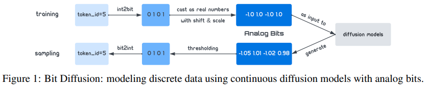

</img>

## Bit Diffusion - Pytorch

Implementation of <a href="https://arxiv.org/abs/2208.04202">Bit Diffusion</a>, Hinton's group's attempt at discrete denoising diffusion, in Pytorch

It seems like they missed the mark for text, but the research direction still seems promising. I think a clean repository will do the research community a lot of benefits for those branching off from here.

## Install

```bash
$ pip install bit-diffusion
```

## Usage

```python
from bit_diffusion import Unet, Trainer, BitDiffusion

model = Unet(
    dim = 32,
    channels = 3,
    dim_mults = (1, 2, 4, 8),
).cuda()

bit_diffusion = BitDiffusion(
    model,
    image_size = 128,
    timesteps = 100,
    time_difference = 0.1,       # they found in the paper that at lower number of timesteps, a time difference during sampling of greater than 0 helps FID. as timesteps increases, this time difference can be set to 0 as it does not help
    use_ddim = True              # use ddim
).cuda()

trainer = Trainer(
    bit_diffusion,
    '/path/to/your/data',             # path to your folder of images
    results_folder = './results',     # where to save results
    num_samples = 16,                 # number of samples
    train_batch_size = 4,             # training batch size
    gradient_accumulate_every = 4,    # gradient accumulation
    train_lr = 1e-4,                  # learning rate
    save_and_sample_every = 1000,     # how often to save and sample
    train_num_steps = 700000,         # total training steps
    ema_decay = 0.995,                # exponential moving average decay
)

trainer.train()
```

Results will be saved periodically to the `./results` folder

If you would like to experiment with the `Unet` and `BitDiffusion` class outside the `Trainer`

```python
import torch
from bit_diffusion import Unet, BitDiffusion

model = Unet(
    dim = 64,
    dim_mults = (1, 2, 4, 8)
)

bit_diffusion = BitDiffusion(
    model,
    image_size = 128,
    timesteps = 1000
)

training_images = torch.randn(8, 3, 128, 128) # images are normalized from 0 to 1
loss = bit_diffusion(training_images)
loss.backward()
# after a lot of training

sampled_images = bit_diffusion.sample(batch_size = 4)
sampled_images.shape # (4, 3, 128, 128)
```

## Citations

```bibtex
@article{Chen2022AnalogBG,
    title   = {Analog Bits: Generating Discrete Data using Diffusion Models with Self-Conditioning},
    author  = {Ting Chen and Ruixiang Zhang and Geoffrey E. Hinton},
    journal = {ArXiv},
    year    = {2022},
    volume  = {abs/2208.04202}
}
```
